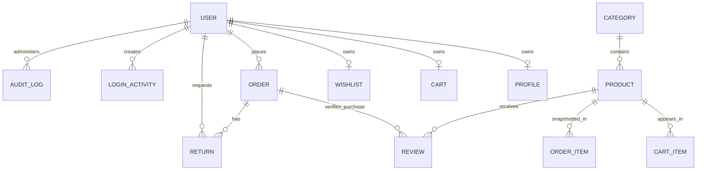

# Database schema

All active persistence uses Mongoose/MongoDB. Schemas use timestamps unless noted.

| Model / collection | Important fields and constraints | Relationships / sensitive fields |
| --- | --- | --- |
| UserAuthenticationModel | `email` unique/indexed; `password`; role enum; `isVerified`; `isActive`; `tokenVersion` | Password, reset hashes, refresh hash/expiry are sensitive and selected out where configured. |
| UserProfile | `userid` unique; names, phone, avatar, address, DOB/gender; referral/wallet counters | User ref; `referralCode` unique sparse; `referredBy` User ref. |
| EmailVerification | user, token, email, used; one-hour TTL | User ref. Token is sensitive. |
| Category | name, tagline, theme color, image metadata | Products reference Category. Deletion returns 409 while linked products exist. |
| ProductModel / `products` | category, name, description, price/mrp min 0, stock min 0, brand, image metadata | Category ref; category indexed. |
| Cart | unique user; embedded items with product, integer quantity, variants/key, server price/mrp | User and Product refs; optimistic concurrency enabled. |
| Wishlist | unique user; product array | User and Product refs. |
| orders | user, item snapshots, shipping address, payment/order enums, totals, Razorpay IDs | User and Product refs; payment signature is sensitive internal data. |
| PaymentIntent | unique Razorpay order; sparse unique payment; idempotency key; immutable checkout snapshot; status; 24-hour TTL | User, Product, Order refs; compound unique `(user,idempotencyKey)`. |
| InventoryModel | unique product, stock/status, change history | Product and changed-by User refs. Product stock remains checkout source of truth. |
| CouponModel | unique code; target type; assigned user; dates, limits, usage | Product, Category, User refs; indexes on lookup fields. |
| Review | user, product, order, rating 1-5, comment, status | Unique `(user,product)`; related refs indexed. |
| ReturnRequest | unique request number, order/user/product, quantity, reason, status/history | Unique `(order,product,user)` and `(createdAt,status)` indexes. |
| Banner | image metadata, text/style, active flag, order | Public catalog content. |
| Policy | unique/indexed slug, title, heading, content, admin editor refs | Admin User refs. |
| HomepageSetting | immutable unique key, bestseller category, color, editor | Category and User refs. |
| ReferralSetting | singleton key, signup/referrer amounts | Unique singleton key. |
| LoginActivity | user, IP, device/OS/browser/location, login/logout, active | User ref; `(userId,loginAt)` index. Privacy-sensitive operational data. |
| AuditLog | admin, action, module, target, description, IP/user-agent | Admin User ref; action/admin indexed. |
| PageView | unique path, name, count | Public aggregate analytics. |

Index recommendations not applied: add order indexes such as `{user:1,createdAt:-1}` and `{orderStatus:1,createdAt:-1}` only after checking production `explain()` output and write volume. Existing unbounded collection APIs should first adopt a compatibility plan for pagination.
